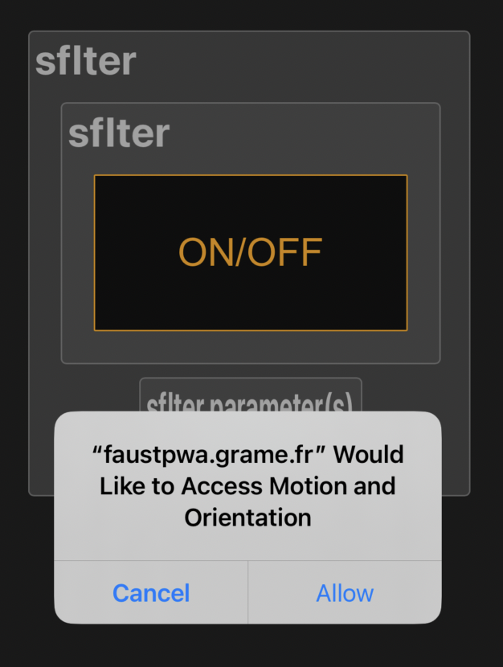
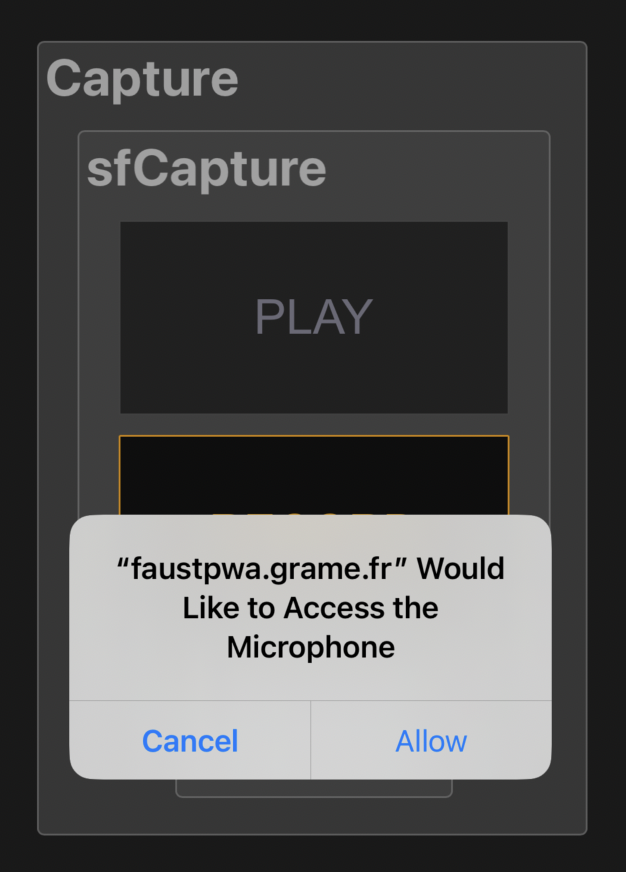

# Faust Progressive Web Applications

 A [Progressive Web Application (PWA)](https://en.wikipedia.org/wiki/Progressive_web_app) is a
type of web application that uses modern web capabilities to deliver an app-like experience to users. Faust DSP programs can be compiled and [exported as PWA](https://faustdoc.grame.fr/manual/deploying/#exporting-for-the-web).

## Installation and update

To install a PWA, flash the QR Code (or click on the picture). You will be able to **directly test the application running in the Web browser**, and use it until the page is closed. 

But to keep the application after the Internet connection has been closed, you will have to **explicitly install it**, so that the application **can then be used alone, without any Internet connection**. To do that click the *Install* or *Add to Home Screen* prompt, and follow the instructions. The PWA will then appear on your device's home screen like a native app. PWAs are cross-platform and work on most devices with modern web browsers like Chrome. 

When a new application version is available, you must first **uninstall the current version before installing the new one**. Additionally, you may need to clear the browser cache (e.g., by using the **"Clear browsing data" option in Chrome or its equivalent in Firefox or Safari**) before proceeding with the installation.

Please note that if the browser cache is cleared, **all previously installed applications will need to be restarted once to reload the necessary data**.

## Screen/power saving 

To ensure the applications run smoothly, the **smartphone screen should remain active**. If the screen turns off automatically, the browser may pause the application and stop audio, sensors, or MIDI. This is due to power-saving features on mobile devices. **We recommend increasing the screen timeout duration in your system settings** for the duration of the performance. This ensures uninterrupted use and proper real-time performance.

## Programs using sound files

Some programs are using sound files that have to be downloadded and copied locally the first time the program is used. Beware: **this make take several seconds**.

## Permission request on iOS

On iOS the user has to explicitely allow permissions when the program needs to access the audio input with the microphone and/or use the accelerometers and gyroscope sensors: 

- an *Access motion and orientation* permission dialog will be displayed the first time the application is loaded and during the first interaction with the screen, like clicking the "ON/OFF" button. See the following example: 

Just click "Allow" so that the instrument can be controlled with gestures.

- if the program is also using the microphone, the *Would like to access the Microphone* permission dialog will also be displayed the first time the application is loaded and during the first interaction with the screen, like clicking the "ON/OFF" button. See the following example: 

Just click "Allow" so that the instrument can record audio input.

